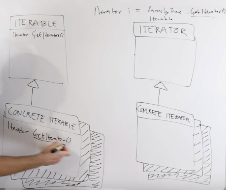

## Iterator pattern
Used to iterate over a collection

If we have several collections containing different
elements and with different structure(maybe a tree, or list),
We want to implement an iterator that independent of
the implementation of collections such that user can 
use this iterator to go through the collection.




```java
public interface Iterable<T> {
    Iterator<T> iterator();
}
```

## Scenario
### Pageable database query


### Binary tree iterator in various orders 
Pre-order, In-order, Post-order
    
    