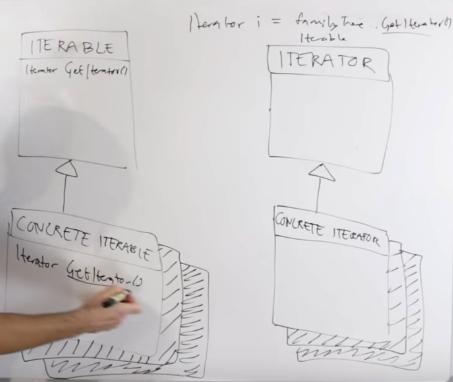

## Iterator pattern

Used to iterate over a collection

if we have several collections containing different
elements and with different structure(maby a tree, or list),
We want to implement a iterator that independent of
the implementation of collections such that user can 
use this iterator to go through the collectoins.




```java
public interface Iterable<T> {
    Iterator<T> iterator();
}
```

    
    