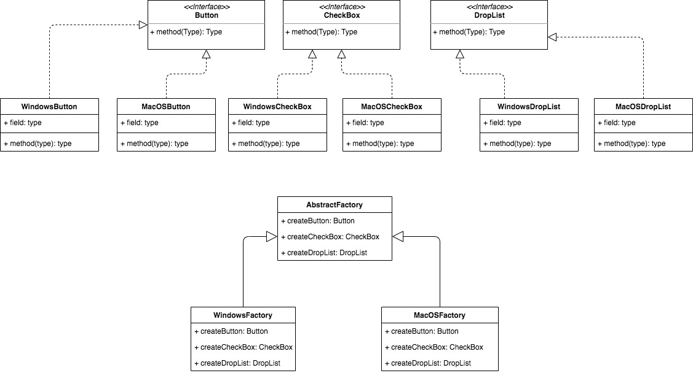

##AbstractFactory pattern

###Intent
> Provide an interface for creating families of related or dependent objects without specifying their concrete classes.

###Scenario
> Suppose we design a factory generates UI components for both windows and MacOS.       
For now, let's assume components are Buttons, CheckBox, DropList. Obviously, only
components for the same OS can be used at same time. It makes no sense that we combine
a windows button and a mac droplist.

> In this case, we can use abstract factory pattern

###Diagram

